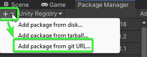
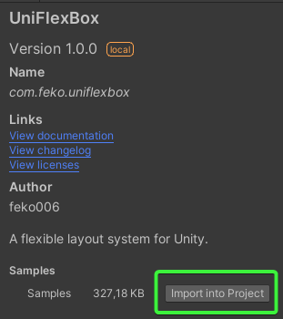

# UniFlexBox

Unity's layouts offer limited ways of layouting elements and have fallen behind some more modern and more powerful ways
of setting up UI. For simple applications and games, they work mostly fine, but for complex UIs they can be limiting and
simply... not enough.

This library uses Facebook's implementation of the [Flexible Box Layout standard](https://www.w3.org/TR/css-flexbox-1/)
called [Yoga](https://github.com/facebook/yoga). The C implementation is wrapped in Unity so that it plays well with the
engine's UI scripts, at a minimal cost.

## Installation

You can install UniFlexBox using any of the following methods (more to come in the future)

1. UPM with git URL
    * Open the Package Manager, press the add button and select 'Add package from git URL...'
    
      
    * Put `https://github.com/feko006/UniFlexBox.git?path=/UniFlexBox` and press Add.

2. .unitypackage
   * Download the latest .unitypackage file from the [releases page](https://github.com/feko006/UniFlexBox/releases).
   * Use the following Unity menu option - `Assets -> Import Package -> Custom Package...`

## How to use

As you would any of the existing Unity layouts.

Slap a `UniFlexBoxLayoutGroup` component on the root GameObject of your layout.

The size of the elements will be respected, but if you want to add even more control, put a `UniFlexBoxLayoutElement`
component on them and tweak to your hearts content.

## Not getting the result you wanted?

This library makes the core flexbox capabilities from Yoga available - if it works in Yoga, it will work here too!

Here are some ideas to try:

* Check the samples! You can download them via UPM.

  
* If not familiar with the flexbox concept, check the Yoga documentation! You can find
  it [here](https://www.yogalayout.dev/docs/styling/align-content).
* As a last resort, open an issue.